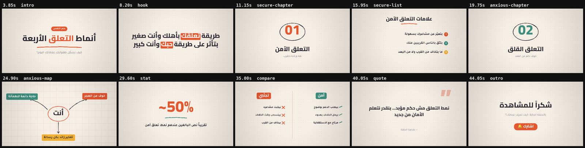

# Explainer Studio 🎬

محرر فيديو **Code-first** لفيديوهات يوتيوب من نوع Explainer (زي Psych2Go). كل فيديو عبارة عن ملف
`project.json` مكشوف، تقدر تعدّله **بإيدك بالماوس** من المحرر، أو يعدّله **الـ AI (Antigravity أو غيره) بالكود**،
والتغيير بيبين **لايف** قدامك.



## التشغيل

المتطلبات: **Python 3.10+** و **ffmpeg** و **Playwright** (هاد الأخير للتصدير فقط).

```bash
pip install -r requirements.txt
playwright install chromium        # مرة وحدة بس (أو استخدم Chrome المنصّب عندك تلقائياً)

python studio.py serve --open      # أو دبل كليك على start.bat (ويندوز) / start.sh
```

بعدها افتح <http://localhost:4100/editor/>، وبيفتح معك مشروع تجريبي جاهز اسمه `attachment-styles` (أنماط التعلق).

## كيف بيشتغل

```
projects/NAME/project.json  ←→  المحرر بالمتصفح (لايف)
            │
            ├── python studio.py validate NAME   ← فحص الأخطاء
            ├── python studio.py sheet NAME      ← صورة لكل المشاهد (عشان الـ AI يشوف شغله)
            ├── python studio.py snapshot NAME 12  ← فريم عند ثانية معينة
            └── python studio.py render NAME     ← exports/NAME.mp4
```

- **أنت:** بتسحب وتكبّر وتدوّر بالماوس، وبتعدّل الخصائص من اللوحة اليمين، وبتحرّك التوقيت على التايملاين.
- **الـ AI:** بيقرأ [AI_GUIDE.md](AI_GUIDE.md) وبيعدّل `project.json` مباشرة. أو إذا شغّال جوا المتصفح، بيستخدم `window.studio`.
- **التصدير:** Playwright بيرسم الفيديو فريم فريم، و ffmpeg بيحوّله لـ MP4 وبيمزج الصوت. يعني الفيديو المصدّر مطابق للمعاينة 100%.

## شو فيه

| | |
|---|---|
| **9 قوالب جاهزة** | عنوان، فصل، قائمة نقاط، جملة قوية، اقتباس، مقارنة، صورة، إحصائية (عداد)، خاتمة |
| **~120 انتقال** | من مكتبة [gl-transitions](https://gl-transitions.com)، مع أسماء سهلة: `glitch` و `cube` و `ink` و `page` و `warp`… |
| **20 حركة دخول وخروج** | كلمة كلمة، كتابة حرف بحرف، رسم الأشكال، Pop، Blur، Reveal من اليمين للعربي… |
| **رسم يدوي** | أسهم ودوائر وخطوط بستايل اليد ([Rough.js](https://roughjs.com)) بتنرسم قدامك |
| **كاميرا** | زوم وتحريك على المشهد كامل، أو Keyframes |
| **صوت** | تعليق صوتي، موسيقى بتوطى تلقائياً تحت الصوت، ومؤثرات (whoosh) مع الانتقالات |
| **4 ثيمات** | `psych` و `midnight` و `clean` و `chalk`. بتغيّر شكل الفيديو كامل بسطر واحد |
| **عربي أولاً** | خطوط Cairo و Tajawal محلية، واتجاه RTL تلقائي |

## اختصارات المحرر

`Space` تشغيل/إيقاف · `←/→` فريم (`Shift` = ثانية) · `Ctrl+Z / Ctrl+Y` تراجع/إعادة · `Ctrl+D` نسخ طبقة ·
`Delete` حذف · أسهم الكيبورد لتحريك الطبقة المحددة · `Esc` إلغاء التحديد · `Alt` أثناء السحب لإلغاء المغناطيس.

## هيكل المشروع

```
editor/            المحرر (HTML + JS بدون أي build)
  engine/          المحرك: core, layers, anim, transitions, templates, themes
  lib/             rough.js + gl-transitions (مضمّنين، ما بدهم إنترنت)
  fonts/           Cairo + Tajawal
server.py          سيرفر محلي (مكتبات بايثون الأساسية فقط)
studio.py          أوامر الـ AI: validate / info / sheet / snapshot / render / catalog
projects/          مشاريعك
media/             صورك وفيديوهاتك وأصواتك
exports/           الفيديوهات المصدّرة
```

حجم المشروع كامل أقل من **1MB**.

## التراخيص

- الكود: ملكك (ما في ملف ترخيص لسا)
- gl-transitions: MIT (وانتقالين BSD)
- Rough.js: MIT
- خطوط Cairo و Tajawal: SIL Open Font License
